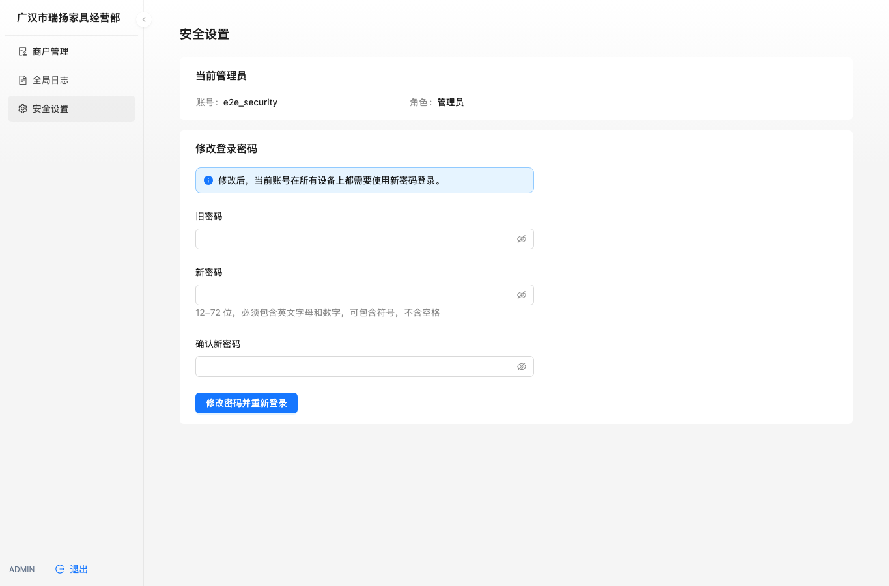
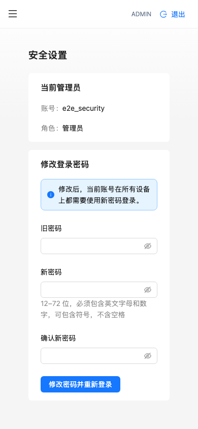

# 管理员安全改密与浏览器回归

本分支在原项目 `second-hand-market-backend` 实现管理员安全设置，并加入实际浏览器业务回归。无数据库迁移；测试只使用合成账号及独立测试数据库，不操作生产管理员、商户或部署配置。

## 接口与权限

- `GET /api/v1/admin/account`：返回当前管理员的 ID、用户名、显示名、角色、状态和最近登录时间，不返回密码或 hash。
- `PUT /api/v1/admin/account/password`：仅接受当前管理员的 `old_password`、`new_password`。账号 ID 来自已验证的会话，客户端传入的 ID/用户名不能选择另一个账号。
- 仅 ACTIVE 的 ADMIN/SUPER_ADMIN 可用。匿名、商户、买家、失效会话和禁用账号拒绝访问。
- 新密码须为 12–72 位可打印 ASCII，包含英文字母和数字，不含空格；禁止与旧密码相同或使用历史公开初始值 `Admin@123456`。
- 修改密码、撤销该管理员全部未撤销会话、记录不含密码材料的审计事件在同一事务提交。任一步失败均回滚。
- 管理员登录的密码校验与会话创建也使用管理员行锁，避免并发旧密码登录在改密后创建有效会话。其他身份及其他管理员不受影响。

## 页面

管理员菜单新增“安全设置”，填写旧密码、新密码和确认新密码。提交中阻止重复请求；失败时保留当前登录并提示错误；成功时清空凭据与会话查询缓存，返回管理员登录页。迟到的请求不能清除已切换身份的新会话。

## 验证

```bash
cd backend
go test ./tests -run '^TestAdminPassword'
# 完整后端回归与静态检查
go test ./...
go vet ./...

cd ../frontend
npm ci
npm test
npm run build
npx playwright install chromium
npm run test:e2e
```

CI 另以独立 `p1_test` MySQL 执行 `TestP1MySQLAdminPasswordSerializesConcurrentLogin`；包含在既有 MySQL 并发门禁中。

Playwright 自动启动 `backend/scripts/e2e_server` 与 Vite，监听本机 `127.0.0.1:19080/19081`。测试 API 必须显式设置 `E2E_FIXTURE=1`，硬编码使用新建临时目录中的 SQLite 与上传目录，不加载任何部署环境或 DB_DSN。进程结束后删除临时数据；端口已占用时拒绝复用现有服务。

浏览器实际覆盖：

1. 管理员错误旧密码被拒绝，成功改密后旧 access/refresh 均失效，再用新密码登录。
2. 管理员开户、商户首次改密、商户不能进入管理员安全页。
3. PNG 上传、新建商品、上下架、增加库存。
4. 创建并关闭订单不扣库存；再次创建并完成订单只扣一件库存。

报告与空白表单截图位于 `frontend/playwright-report/`、`frontend/test-results/`，CI 上传 `browser-test-report` 制品。所有报告中的账号和数据均为本次生成的测试数据。不要将这些测试改为指向线上地址。

## 后续跟踪

- 本功能对应 Issue #28；待审阅合并后再完成工单验收。
- #24（即时会话权限）与 #25（事务幂等）的主要实现已随 PR #61/#63 进入 main，应依据相应测试和发布记录核对旧工单，不重复开发。
- 异机备份/恢复、意向历史唯一约束和小程序真实平台验收仍是独立工作，不属于此分支。
- 空调项目需要后续单独适配本次改密入口；不可混用两个项目的数据库或部署标识。

## 页面预览（合成测试账号）




