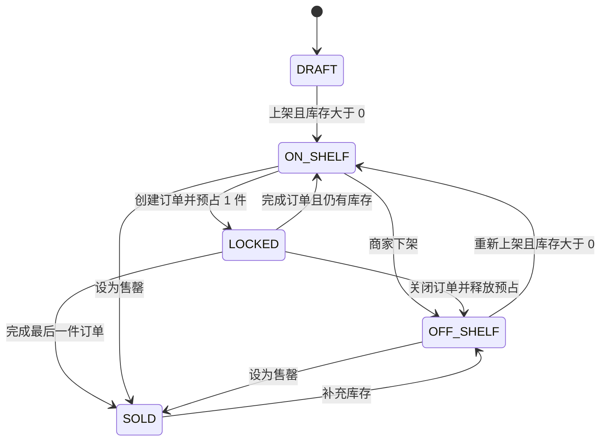

# 商品售罄与可恢复销售状态设计

| 项目 | 内容 |
|---|---|
| 日期 | 2026-08-09 |
| 分支 | `hotfix/hy/0000_product_sale_status` |
| 基线 | `origin/master@4c9617740bfe5e86de656952c92a34131ed607b4` 及本分支未提交的订单库存联动修复 |
| 状态 | 已按本文实现并完成本地功能验证；Linux-only 独立验收合同待 Linux 环境复核 |
| 目标 | 商品移除“已关闭”状态，将 `SOLD` 定义为可补库存恢复销售的“售罄”状态，并保持订单关闭语义独立 |

## 1. 背景

当前商品存在 `DRAFT/ON_SHELF/LOCKED/OFF_SHELF/SOLD/CLOSED` 六种状态，订单存在 `CREATED/COMPLETED/CLOSED` 三种状态。

本分支已经修复订单与库存联动：创建订单预占 1 件库存；完成订单扣减库存和预占；有剩余库存时商品恢复 `ON_SHELF`，最后一件完成时商品库存归零并进入 `SOLD`；关闭订单释放预占、库存不变，商品进入 `OFF_SHELF`。

新业务规则进一步明确：

1. 商品没有“已关闭”状态。
2. 商品存在“售罄”状态。
3. 订单保留“已关闭”状态。
4. 商家将商品设为售罄时，库存同步归零。
5. 售罄商品补充库存后可以重新上架销售。

## 2. 需求边界

| 类型 | 结论 |
|---|---|
| 核心目标 | 建立“售罄库存为 0、补库存后可恢复销售”的商品状态流 |
| 商品状态 | 仅保留 `DRAFT/ON_SHELF/LOCKED/OFF_SHELF/SOLD` |
| `SOLD` 语义 | API 状态码继续使用 `SOLD`，展示文案统一为“售罄” |
| 订单状态 | `CREATED/COMPLETED/CLOSED` 保持不变 |
| 意向状态 | 意向的 `CLOSED` 不属于商品状态，本需求不修改 |
| 库存模型 | 保留当前 `stock/reserved_stock` 和单活动订单模型 |
| 恢复销售 | 必须先补库存，再由商家显式重新上架；补库存不自动开始销售 |
| 非目标 | 不引入 `SOLD_OUT` 新状态码、不改订单数量输入、不支持多个活动订单、不改支付或销售额统计 |
| 安全范围 | 不新增权限、安全、幂等或审计体系，只复用现有机制 |

### 2.1 评审定稿结论

本文已合并以下两份评审的有效结论，并修正其中与代码现状不符的表述：

- `docs/review/2026-08-09-product-sold-out-state-design-review.md`
- `docs/review/2026-08-09-product-sold-out-state-design-review-code-check.md`

| 议题 | 定稿结论 |
|---|---|
| 0 库存 `OFF_SHELF` | 保持下架，不允许无库存直接标记售罄 |
| `SOLD` 删除/编辑 | 本次不增加；只能补库存后进入 `OFF_SHELF` |
| 历史 `CLOSED` 可见性 | 转为 `OFF_SHELF` 后允许历史详情重新可见，但不可购买 |
| 小程序购买入口 | 非 `ON_SHELF` 商品隐藏“我想要”；不恢复已下线的意向页面 |
| 历史 `product_close` 日志 | 保留前端展示映射，只停止产生新日志 |
| Dashboard | 商品统计直接移除 `closed`；订单统计继续保留 `closed` |
| 非目标 | 不增加商品状态查询白名单、`SOLD` 直接删除、审计事务化或额外安全治理 |

## 3. 方案比较

| 方案 | 做法 | 优点 | 缺点 | 结论 |
|---|---|---|---|---|
| A. 保留 `SOLD` 并改为“售罄” | 保持数据库和 API 状态码不变，增加 `SOLD -> OFF_SHELF` 的补库存恢复路径 | 改动最小；兼容现有订单、库存流水和接口数据 | 代码常量名仍是 `SOLD` | 采用 |
| B. 新增 `SOLD_OUT` | 将商品状态码改为 `SOLD_OUT`，迁移现有 `SOLD` 数据 | 代码语义最直观 | 需要数据库数据迁移、前后端契约变更和历史兼容 | 不采用 |
| C. 删除 `SOLD`，只用 `OFF_SHELF + stock=0` | 通过库存判断是否售罄 | 状态数量最少 | 无法区分主动下架和售罄，列表筛选和用户展示不清晰 | 不采用 |

## 4. 业务不变量

| 编号 | 不变量 |
|---|---|
| I1 | 当前状态为 `SOLD` 时，`stock = 0`、`reserved_stock = 0`、`active_order_id = NULL` |
| I2 | 当前状态为 `ON_SHELF` 时，可销售库存必须大于 0 |
| I3 | 当前状态为 `LOCKED` 时，必须存在匹配的活动订单和对应预占库存 |
| I4 | 商品补库存只能改变库存及必要的商品状态，不创建订单 |
| I5 | 订单关闭只关闭订单；商品回到 `OFF_SHELF`，库存不减少 |
| I6 | 商品不再进入 `CLOSED`；订单和意向仍可进入各自的 `CLOSED` |

## 5. 目标状态机



### 5.1 状态定义

| 状态 | 展示文案 | 库存要求 | 允许的核心操作 |
|---|---|---|---|
| `DRAFT` | 草稿 | `stock >= 0` | 编辑、补减库存、上架、删除 |
| `ON_SHELF` | 在售 | `stock - reserved_stock > 0` | 下架、创建订单、调整库存、设为售罄 |
| `LOCKED` | 锁定 | `reserved_stock > 0` | 完成订单、关闭订单 |
| `OFF_SHELF` | 下架 | `stock >= 0` | 编辑、调整库存、重新上架、库存大于 0 时设为售罄、删除 |
| `SOLD` | 售罄 | `stock = 0` | 查看、补充库存 |

`SOLD` 不再是永久终态。它只能通过补充库存离开，并统一进入 `OFF_SHELF`，避免补库存后商品未经商家确认自动恢复销售。

### 5.2 状态校验职责

`productTransitions` 只服务通用商品状态入口以及创建订单前的 `ON_SHELF -> LOCKED` 校验，不承载订单完成、订单关闭和库存调整的领域副作用。

```text
productTransitions:
  DRAFT     -> ON_SHELF
  ON_SHELF  -> OFF_SHELF, LOCKED
  OFF_SHELF -> ON_SHELF
  LOCKED    -> 无通用商品 API 出边
  SOLD      -> 无通用商品 API 出边
```

以下迁移只允许由对应领域事务触发：

| 领域路径 | 允许迁移 |
|---|---|
| 订单完成 | `LOCKED -> ON_SHELF | SOLD` |
| 订单关闭 | `LOCKED -> OFF_SHELF` |
| 售出扣减归零 | `ON_SHELF | OFF_SHELF -> SOLD` |
| 售罄补库存 | `SOLD -> OFF_SHELF` |

不得把 `SOLD -> OFF_SHELF` 加入通用 `productTransitions`，否则现有商品下架接口会绕过补库存直接离开售罄状态。

## 6. 核心流程

### 6.1 创建订单

| 步骤 | 行为 |
|---|---|
| 1 | 仅允许 `ON_SHELF` 且可销售库存至少为 1 的商品创建订单 |
| 2 | 事务内锁定商品行，订单数量固定为 1 |
| 3 | `reserved_stock += 1`，商品进入 `LOCKED`，写入 `active_order_id` |

该流程沿用本分支现有修复，不因售罄状态调整而改变。

### 6.2 完成订单

| 完成前库存 | 完成后库存 | 商品目标状态 |
|---|---|---|
| `stock > quantity` | `stock -= quantity`，`reserved_stock -= quantity` | `ON_SHELF` |
| `stock = quantity` | `stock = 0`，`reserved_stock = 0` | `SOLD`（售罄） |

订单进入 `COMPLETED`，清理 `active_order_id`。最后一件成交后库存归零，满足售罄不变量。

### 6.3 关闭订单

订单从 `CREATED` 进入 `CLOSED`，释放订单对应的预占库存，商品库存总量不变，商品从 `LOCKED` 进入 `OFF_SHELF`，并清理 `active_order_id`。

关闭订单不得把商品改为 `SOLD`，也不得把商品库存改为 0。

### 6.4 商家手动设为售罄

最小实现复用现有库存调整接口和 `MARK_SOLD` 流水：

```text
POST /api/v1/merchant/products/:id/stock-adjustments
```

商家后台提供“设为售罄”快捷操作，提交：

```json
{
  "adjustment_type": "MARK_SOLD",
  "all_remaining": true,
  "reason": "商品已售罄"
}
```

`all_remaining=true` 只允许与 `MARK_SOLD` 组合使用。后端不信任页面库存数量，而是在商品行锁内读取当前库存并将实际全部剩余库存作为本次流水数量。后端在同一事务中完成：

1. 校验商品为 `ON_SHELF` 或 `OFF_SHELF`，且没有活动订单。
2. 将 `stock` 扣减到 0。
3. 保持 `reserved_stock = 0`。
4. 将状态改为 `SOLD` 并记录 `sold_at`。
5. 写入 `product_stock_adjustments` 和现有操作日志。

通用库存调整中的 `MARK_SOLD + quantity` 部分扣减能力继续保留；只有扣减后库存为 0 时才进入 `SOLD`。快捷操作不提交 `quantity`，响应中的 `quantity` 为后端实际归零数量，并以 `stock_after = 0`、`reserved_stock = 0`、`status_after = SOLD` 作为成功条件。

`stock=0` 的 `OFF_SHELF` 商品不能执行快捷售罄。它表示非销售原因导致的零库存下架，必须先补库存后才能产生新的售出扣减。

### 6.5 售罄后补库存并重新上架

| 步骤 | 请求/动作 | 结果 |
|---|---|---|
| 1 | 对 `SOLD` 商品执行 `INCREASE` | `stock += quantity`，状态自动变为 `OFF_SHELF` |
| 2 | 商家检查或编辑商品信息 | 商品保持下架，不对买家销售 |
| 3 | 商家点击“上架” | 校验图片完整且库存大于 0，状态变为 `ON_SHELF` |

`SOLD` 状态仅允许 `INCREASE`。`DECREASE` 和 `MARK_SOLD` 在库存已经为 0 时没有有效业务含义，继续返回非法状态流转。

### 6.6 非销售原因扣减到 0

`DECREASE` 表示盘亏、损耗等非销售减少。`ON_SHELF` 商品通过 `DECREASE` 扣到 0 时继续进入 `OFF_SHELF`，不进入 `SOLD`。

这样可以保持两类业务含义：

| 结果 | 状态 |
|---|---|
| 因订单成交或 `MARK_SOLD` 售出导致库存归零 | `SOLD`（售罄） |
| 因盘亏、损耗等非销售原因导致库存归零 | `OFF_SHELF`（下架） |

## 7. 商品 `CLOSED` 移除规则

商品维度需要移除以下能力：

| 位置 | 目标调整 |
|---|---|
| 后端模型 | 删除 `ProductClosed` 常量引用；订单和意向的 `CLOSED` 保留 |
| 商品状态机 | 删除 `DRAFT/ON_SHELF/OFF_SHELF -> CLOSED` 迁移 |
| 商家 API | 移除 `POST /merchant/products/:id/close` 路由和 handler |
| 商品删除规则 | 只允许符合现有其他条件的 `DRAFT/OFF_SHELF` 商品删除，不再判断 `CLOSED` |
| 商家前端 | 移除商品“关闭/关闭商品”按钮、API 方法、状态筛选和状态文案 |
| 仪表盘 | 商品统计移除 `closed`；订单统计继续保留 `closed` |
| 文档与测试 | 删除商品关闭状态的契约和用例；不得删除订单关闭用例 |

数据库中的 `products.closed_at` 本次可以保留为兼容字段，不再由新业务写入，避免为删除未使用字段扩大结构迁移范围。

## 8. API 与后端规则

### 8.1 库存调整权限矩阵

| 商品状态 | `INCREASE` | `DECREASE` | `MARK_SOLD` |
|---|---|---|---|
| `DRAFT` | 允许 | 允许 | 禁止，包括部分扣减和快捷售罄 |
| `ON_SHELF` | 允许 | 允许 | 允许 |
| `OFF_SHELF` | 允许 | 允许 | 允许 |
| `LOCKED` | 禁止 | 禁止 | 禁止 |
| `SOLD` | 允许，完成后转 `OFF_SHELF` | 禁止 | 禁止 |

### 8.2 上架校验

商品进入 `ON_SHELF` 前必须同时满足：

1. 商品状态允许上架。
2. 至少存在一张有效商品图片。
3. `stock - reserved_stock > 0`。
4. 不存在活动订单绑定。

库存为 0 的 `DRAFT/OFF_SHELF` 商品不得上架。

### 8.3 错误处理

| 场景 | 返回码 | 说明 |
|---|---|---|
| 售罄商品执行 `DECREASE` 或 `MARK_SOLD` | `10005` | 非法状态流转 |
| 库存为 0 时上架 | `10005` | 非法状态流转 |
| 锁定商品设为售罄或调整库存 | `10005` | 必须先完成或关闭活动订单 |
| `MARK_SOLD` 数量超过库存 | `10005` | 禁止库存变负 |
| 补库存数量小于等于 0 | `10001` | 参数非法 |

库存、状态和库存流水必须在同一事务中提交或回滚，并继续使用商品行锁避免并发覆盖。操作日志继续复用现有事务句柄和 best-effort 写入机制；日志写入失败不会阻止核心库存事务提交，本次不扩展审计体系。

## 9. 商家后台设计

### 9.1 商品状态文案

| 状态码 | 文案 |
|---|---|
| `DRAFT` | 草稿 |
| `ON_SHELF` | 在售 |
| `LOCKED` | 锁定 |
| `OFF_SHELF` | 下架 |
| `SOLD` | 售罄 |

商品状态类型和筛选中不再包含 `CLOSED`。订单状态中的 `CLOSED` 继续显示“已关闭”。

### 9.2 商品操作矩阵

| 状态 | 操作 |
|---|---|
| `DRAFT` | 编辑、上架、调整库存、删除 |
| `ON_SHELF` | 下架、创建订单、调整库存、设为售罄 |
| `LOCKED` | 查看关联订单 |
| `OFF_SHELF` | 编辑、上架、调整库存、设为售罄、删除 |
| `SOLD` | 查看、补充库存 |

`SOLD` 商品打开库存调整弹窗时只展示“补充库存”。补充成功后商品变为 `OFF_SHELF`，页面刷新后再展示“上架”入口。

## 10. 买家小程序设计

| 场景 | 行为 |
|---|---|
| 商品公开列表 | 仍只返回和展示 `ON_SHELF` 商品 |
| 售罄商品详情 | 历史链接、收藏和浏览记录仍可进入详情，状态显示“售罄”，库存显示 0 |
| 联系购买 | 所有非 `ON_SHELF` 商品在详情页和收藏页隐藏“我想要”，展示不可购买状态 |
| 补库存后下架 | 商品仍不进入公开列表 |
| 重新上架后 | 商品重新进入公开列表并允许提交意向 |

当前可达的“我想要”按钮调用统一联系电话，不会进入已经从 `app.config.ts` 移除的意向页面。本次不恢复意向页面。后端继续以 `product.Status == ON_SHELF` 计算 `can_submit_intent`；详情页消费该字段，收藏页按商品 `status` 判断。详情、收藏和通用商品卡统一使用商品状态文案映射，不再裸显 `SOLD`。

## 11. 数据兼容

`products.status` 是字符串字段，没有商品状态枚举约束，因此本次不需要修改表结构。

新增并注册前向数据迁移 `backend/migrations/0007_product_sold_out_state.up.sql`。该迁移在后端代码发布前执行：

```sql
UPDATE products
SET status = 'OFF_SHELF'
WHERE status = 'CLOSED';

UPDATE products
SET status = 'OFF_SHELF'
WHERE status = 'SOLD' AND stock > 0;
```

| 数据项 | 处理 |
|---|---|
| 历史商品 `CLOSED` | 转为 `OFF_SHELF`，库存保持原值 |
| `products.closed_at` | 保留历史值，不再新增写入 |
| `products.sold_at` | 记录最近一次进入 `SOLD` 的时间；补库存离开售罄时保留，后续再次售罄时更新 |
| 历史商品 `SOLD` 且库存为 0 | 保持 `SOLD`，允许后续补库存恢复 |
| 历史商品 `SOLD` 且库存大于 0 | 转为 `OFF_SHELF` 并保留库存，避免丢失真实库存 |
| 订单和意向 `CLOSED` | 不做任何转换 |

迁移后必须校验 `status='CLOSED'` 和 `status='SOLD' AND stock>0` 的记录数均为 0。未满足时不得发布后端业务代码。

## 12. 影响范围

| 层级 | 主要文件/模块 | 调整内容 |
|---|---|---|
| 后端模型 | `backend/internal/model/models.go` | 移除商品 `ProductClosed` 使用，保留订单/意向 `CLOSED` |
| 商品状态 | `backend/internal/stateflow/stateflow.go` | 删除商品关闭边；订单和库存领域恢复边不加入通用状态表 |
| 库存调整 | `backend/internal/app/product_stock_adjustment_handlers.go` | `SOLD` 仅允许补库存并转 `OFF_SHELF`；设为售罄归零 |
| 商品 API | `backend/internal/app/product_handlers.go`、`server.go` | 移除商品关闭入口；上架增加库存校验 |
| 订单 | `backend/internal/app/order_handlers.go` | 保持本分支已实现的预占、扣减、释放和状态流 |
| 商家统计 | `backend/internal/app/merchant_handlers.go` | 商品统计移除 `closed`，订单统计保留 |
| 数据迁移 | `backend/migrations/0007_product_sold_out_state.up.sql`、`backend/scripts/migrate` | 转换历史 `CLOSED` 和矛盾 `SOLD` 数据并注册迁移 |
| 商家前端 | 商品状态常量、列表、详情、Dashboard、库存弹窗、API service | 售罄文案、补库存恢复、快捷售罄、移除商品关闭入口 |
| 小程序 | 商品详情、收藏页、商品状态映射及相关测试 | 显示售罄并隐藏不可购买入口 |
| 文档 | 商品状态机、API、数据模型、页面规范 | 同步新状态定义和操作矩阵 |

## 13. 测试设计

### 13.1 后端回归测试

| 编号 | 用例 |
|---|---|
| B1 | 完成非最后一件订单后库存减少，商品恢复 `ON_SHELF` |
| B2 | 完成最后一件订单后 `stock=0`、`reserved_stock=0`、商品为 `SOLD` |
| B3 | 关闭订单后释放预占、库存不变、商品为 `OFF_SHELF` |
| B4 | `ON_SHELF/OFF_SHELF` 商品设为售罄后库存归零并写调整流水 |
| B5 | `SOLD` 商品补库存后库存增加并变为 `OFF_SHELF` |
| B6 | `SOLD` 商品不能直接上架；补库存后可以上架 |
| B7 | 库存为 0 的 `DRAFT/OFF_SHELF` 商品不能上架 |
| B8 | 商品路由和状态机不再支持 `CLOSED`，订单关闭仍正常 |
| B9 | `LOCKED` 商品不能设为售罄或通过商品接口直接下架 |
| B10 | `DRAFT` 商品不能执行部分或快捷 `MARK_SOLD` |
| B11 | `ON_SHELF` 经 `DECREASE` 到 0 后为 `OFF_SHELF`，不是 `SOLD` |
| B12 | 部分 `MARK_SOLD` 不归零时状态保持不变 |
| B13 | `SOLD` 只允许 `INCREASE`，补库存后转 `OFF_SHELF` |
| B14 | 买家详情中的 `SOLD` 可见且 `can_submit_intent=false` |
| B15 | 商品关闭路由不存在，订单关闭路由继续可用 |

### 13.2 商家前端测试

| 编号 | 用例 |
|---|---|
| F1 | 商品状态类型、筛选和文案不包含 `CLOSED`，`SOLD` 显示“售罄” |
| F2 | 商品列表和详情不再显示“关闭商品”操作 |
| F3 | `SOLD` 商品只显示“补充库存”调整类型 |
| F4 | 补库存后刷新为 `OFF_SHELF` 并显示“上架”入口 |
| F5 | “设为售罄”提交 `MARK_SOLD + all_remaining=true`，并使用响应中的实际扣减数量 |
| F6 | Dashboard 不再展示或请求商品 `closed` 统计 |
| F7 | 历史日志仍能显示 `product_close` 文案 |

### 13.3 小程序测试

| 编号 | 用例 |
|---|---|
| M1 | `SOLD` 商品详情显示“售罄”和库存 0 |
| M2 | `SOLD/OFF_SHELF/LOCKED` 商品不能进入购买意向流程 |
| M3 | 补库存但未上架的商品不进入公开列表 |
| M4 | 重新上架后商品恢复公开列表和购买意向能力 |
| M5 | 详情页和收藏页对非 `ON_SHELF` 商品隐藏“我想要” |

## 14. 验收标准

| 编号 | 验收项 |
|---|---|
| AC1 | 商品 API、商家页面和商品统计中不再出现商品 `CLOSED` |
| AC2 | 订单 `CLOSED` 状态及关闭订单流程保持可用 |
| AC3 | 商家将商品设为售罄后，商品状态为 `SOLD` 且库存、预占库存均为 0 |
| AC4 | 最后一件订单完成后自动进入售罄；非最后一件完成后继续在售 |
| AC5 | 售罄商品可以补库存，补库存后状态为 `OFF_SHELF` |
| AC6 | 补库存不会自动销售，商家手动上架后才进入 `ON_SHELF` |
| AC7 | 任何库存为 0 的商品都不能进入 `ON_SHELF` |
| AC8 | 订单关闭后商品下架、库存不变、预占释放 |
| AC9 | 商家后台和小程序统一显示“售罄”，不显示商品“已关闭” |
| AC10 | 相关后端、商家前端和小程序回归测试通过；现有基线环境问题单独记录，不计为本功能通过 |

## 15. 发布与回退

推荐发布顺序：

1. 执行并验证 `0007_product_sold_out_state`，确认商品 `CLOSED` 和异常 `SOLD + stock > 0` 数量均为 0。
2. 发布后端状态、库存调整、上架校验和统计变更。
3. 发布商家后台状态文案与操作入口。
4. 发布小程序售罄展示和购买入口限制。
5. 验证订单完成、订单关闭、手动售罄、补库存、重新上架完整链路。

如需回退，必须同时回退前后端商品状态契约。已经从 `CLOSED` 转为 `OFF_SHELF` 的商品不自动还原，避免恢复已废弃的商品关闭语义。

## 16. 自审结果

| 检查项 | 结果 |
|---|---|
| 占位符检查 | 无占位符或未完成章节 |
| 一致性检查 | 商品状态、库存不变量、订单流、商家端和小程序行为一致；通用状态边与领域状态边已分开 |
| 范围检查 | 未扩展订单数量、多活动订单、支付、销售额和安全治理 |
| 歧义检查 | 明确 `DRAFT` 禁止 `MARK_SOLD`、快捷售罄使用 `all_remaining`、0 库存下架不直接售罄、`SOLD` 本次不直接删除 |
| 兼容检查 | 明确历史商品 `CLOSED` 和异常 `SOLD` 数据处理方式 |
